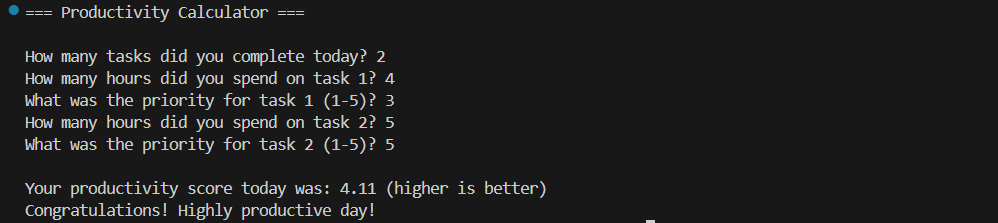

# Productivity Calculator (CLI App)

A simple command-line (CLI) application to calculate your daily productivity based on completed tasks, focused hours, and daily goals.  



## Features

- Calculate daily productivity based on tasks completed and focus time.
- Display percentage of daily goal achieved.
- Simple and easy-to-use terminal interface.

## Technologies

- Python 3.12.3

## How to Use

1. Clone the repository:
```bash
git clone https://github.com/GoldzTech/Productivity-Calculator.git
cd productivity-calculator
